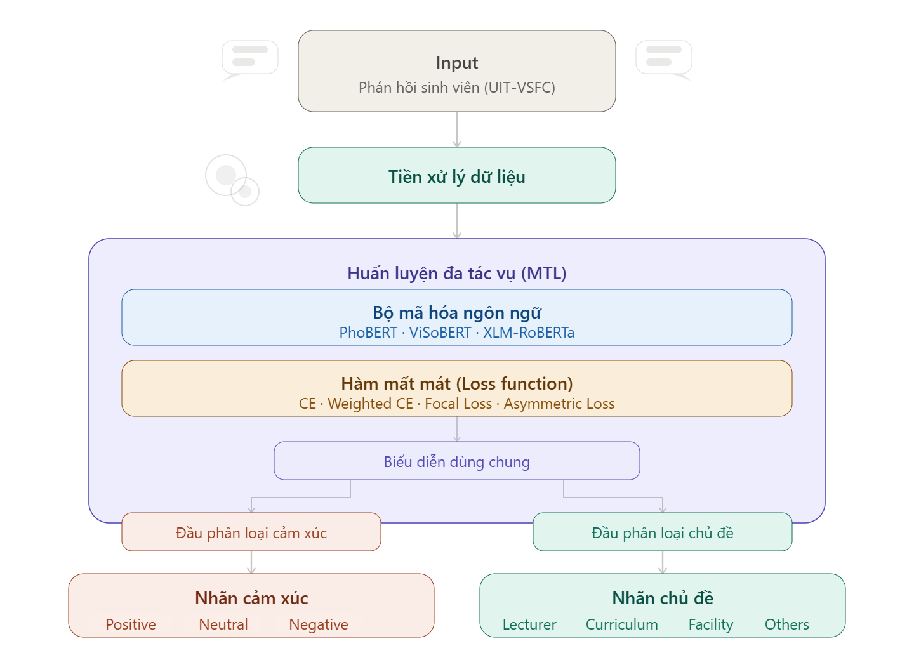
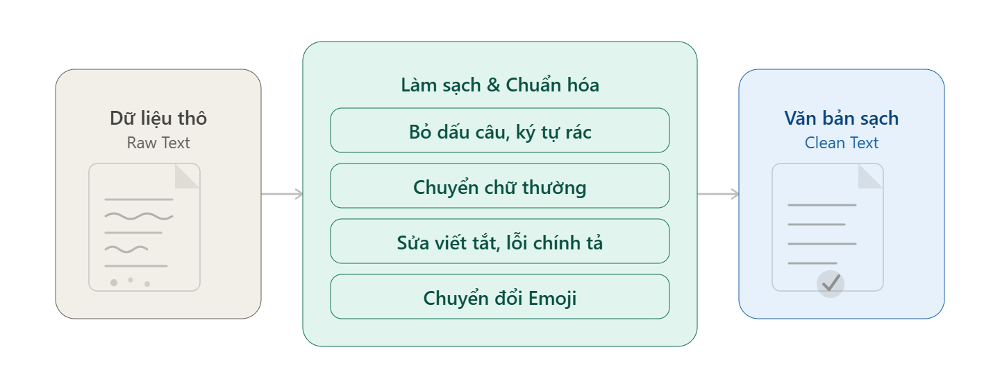

# Analyzing-Vietnamese-student-feedback

## Thông tin đề tài

- **Họ và tên:** Nguyễn Thị Thu Trang
- **Mã sinh viên:** 22028254
- **Tên đề tài:** Nghiên cứu xây dựng mô hình học đa tác vụ kết hợp xử lý mất cân bằng lớp cho phân tích phản hồi sinh viên

## Giới thiệu

Dự án nghiên cứu và thực nghiệm các phương pháp học sâu cho bài toán phân tích phản hồi sinh viên tiếng Việt (Vietnamese Student Feedback Analysis) bằng kỹ thuật học đa tác vụ (Multi-task Learning - MTL).

Nghiên cứu tập trung vào hai nhiệm vụ chính:

- Phân tích cảm xúc (Sentiment Analysis)
- Phân loại chủ đề (Topic Classification)

Trong quá trình thực nghiệm, đề tài sử dụng nhiều kiến trúc học đa tác vụ khác nhau kết hợp với các mô hình ngôn ngữ tiền huấn luyện (Pre-trained Language Models - PLMs).

## Các mô hình backbone được sử dụng

- PhoBERT
- ViSoBERT
- XLM-RoBERTa

## Các kiến trúc học đa tác vụ (MTL Architectures)

| Ký hiệu | Kiến trúc                            |
| ------- | ------------------------------------ |
| B0      | Single-task Learning (STL)           |
| B1      | Hard Parameter Sharing               |
| B2      | Cross-task Attention                 |
| B3      | Soft Parameter Sharing               |
| B4      | Multi-gate Mixture-of-Experts (MMoE) |
| B5      | Hard Sharing + PCGrad                |
| B6      | Soft Sharing + PCGrad                |

## Các hàm mất mát được sử dụng

- Cross Entropy Loss
- Weighted Cross Entropy Loss
- Focal Loss
- Asymmetric Loss

## Sơ đồ luồng xử lý tổng quát của phương pháp đề xuất

<p align="center">
  
</p>

<p align="center">
  <em>Hình: Sơ đồ luồng xử lý tổng quát của phương pháp đề xuất</em>
</p>

## Quy trình làm sạch dữ liệu

<p align="center">
  
</p>

<p align="center">
  <em>Hình: Quy trình làm sạch dữ liệu</em>
</p>

## Cấu trúc thư mục

```text
Analyzing-Vietnamese-student-feedback
│
├───.gitignore
|
├───README.md
|
└───student-feedback-mtl
    |
    ├───README.md
    │
    ├───requirement.txt
    |
    ├───images
    │   ├───pipeline.png
    │   └───preprocessing.png
    |
    ├───data
    │   ├───gda
    │   │       new_train_llm_final_gda.csv
    │   │       old_train_llm_final_gda.csv
    │   │
    │   ├───raw
    │   │       test.csv
    │   │       train.csv
    │   │       val.csv
    │   │
    │   └───relabeled
    │           test_relabeled.csv
    │           train_relabeled.csv
    │           val_relabeled.csv
    │
    └───notebooks
        ├───EDA
        │       eda-uit-vsfc.ipynb
        │       eda_mtl_feasibility_analysis.ipynb
        │       gda_gemini_api.ipynb
        │
        ├───PhoBERT
        │       B0_PhoBERT.ipynb
        │       B1-B6-CrossEntropy-PhoBERT.ipynb
        │       B1_HardSharing_DifferentLosses.ipynb
        │       B1_HardSharing_GDA.ipynb
        │       B1_HardSharing_Relabeled.ipynb
        │       B5_HardSharing_PCGrad_GDA.ipynb
        │       B5_HardSharing_PCGrad_Relabeled.ipynb
        │
        ├───VisoBERT
        │       B0_Visobert.ipynb
        │       B1-B6-CrossEntropy-Visobert.ipynb
        │
        └───XLM-RoBERTa
                B0_XLM.ipynb
                B1-B6-CrossEntropy-XLM.ipynb
```

## Mô tả dữ liệu

### Dataset gốc

Bộ dữ liệu phản hồi sinh viên tiếng Việt bao gồm:

- train.csv
- val.csv
- test.csv

Mỗi mẫu dữ liệu gồm:

- Nội dung phản hồi
- Nhãn cảm xúc
- Nhãn chủ đề

### Dataset relabeled

Tập dữ liệu được gán nhãn lại nhằm cải thiện chất lượng nhãn và giảm nhiễu dữ liệu.

Bao gồm:

- train_relabeled.csv
- val_relabeled.csv
- test_relabeled.csv

### Dataset GDA

Dữ liệu mở rộng sử dụng kỹ thuật sinh dữ liệu bằng mô hình ngôn ngữ lớn (LLM-based GDA).

Bao gồm:

- old_train_llm_final_gda.csv
- new_train_llm_final_gda.csv

## Nội dung notebook

### EDA

- Phân tích dữ liệu khám phá
- Kiểm tra phân bố nhãn
- Phân tích tính khả thi của học đa tác vụ
- Sinh dữ liệu bằng Gemini API

### PhoBERT / ViSoBERT / XLM-RoBERTa

Bao gồm:

- Huấn luyện STL
- Huấn luyện MTL
- So sánh các kiến trúc
- So sánh các hàm loss
- Thực nghiệm với GDA
- Thực nghiệm với relabeled dataset
- Thực nghiệm với PCGrad

## Yêu cầu môi trường

Cài đặt thư viện:

```bash
pip install -r requirement.txt
```

## Cách chạy notebook

Khởi động Jupyter Notebook:

```bash
jupyter notebook
```

Hoặc sử dụng JupyterLab:

```bash
jupyter lab
```

Sau đó mở notebook tương ứng trong thư mục:

```text
student-feedback-mtl/notebooks/
```

## Công nghệ sử dụng

- Python
- PyTorch
- TensorFlow / Keras
- HuggingFace Transformers
- Scikit-learn
- Pandas
- NumPy
- Matplotlib
- Seaborn

## Kết quả nghiên cứu

Nghiên cứu tiến hành:

- So sánh hiệu năng giữa STL và MTL
- Đánh giá tác động của các kiến trúc chia sẻ tham số
- Đánh giá ảnh hưởng của các hàm mất mát
- Đánh giá hiệu quả của PCGrad
- Đánh giá tác động của relabeled dataset và GDA

Các chỉ số đánh giá:

- Precision
- Recall
- F1-score

So sánh với các nghiên cứu trước:

| Nghiên cứu                          | Phương pháp / Mô hình                                   | Sentiment μF1 | Sentiment mF1 | Sentiment wF1 | Topic μF1  | Topic mF1  | Topic wF1  |
| ----------------------------------- | ------------------------------------------------------- | ------------- | ------------- | ------------- | ---------- | ---------- | ---------- |
| Nguyễn Văn Kiệt và cs. (2018)       | MaxEnt (Baseline gốc)                                   | -             | -             | 0.8800        | -          | -          | 0.8400     |
| Nguyen Duc Vu và cs. (2018)         | LSTM + Dependency BiLSTM + SVM                          | -             | -             | 0.9020        | -          | -          | -          |
| Nguyen V. X. Phu và cs.             | BiLSTM                                                  | 0.9200        | -             | -             | 0.8960     | -          | -          |
| Huynh và cs. (2020)                 | Ensemble (BERT, CNN, BiLSTM, LSTM)                      | 0.9279        | -             | -             | 0.8970     | -          | -          |
| Le Si Lac và cs. (2020)             | BiLSTM + CNN                                            | -             | -             | 0.9355        | -          | -          | -          |
| Truong Trong Loc và cs. (2020)      | PhoBERT + MLP                                           | -             | -             | 0.9392        | -          | -          | -          |
| Dang Van Thin và cs. (2023)         | Heterogeneous Ensemble                                  | -             | -             | 0.9403        | -          | -          | -          |
| Dang Van Thin và cs. (2024)         | LLM Few Shot                                            | -             | -             | 0.9127        | -          | -          | -          |
| **Nghiên cứu này (Test cũ)**        | **PhoBERT Hard Sharing + Cross Entropy + PCGrad**       | **0.9406**    | **0.8394**    | **0.9379**    | **0.8932** | **0.8054** | **0.8916** |
| **Nghiên cứu này (Test relabeled)** | **PhoBERT Hard Sharing + Cross Entropy + PCGrad + GDA** | **0.9599**    | **0.8762**    | **0.9586**    | **0.9302** | **0.8576** | **0.9289** |

## License

Dự án phục vụ mục đích học tập và nghiên cứu.
